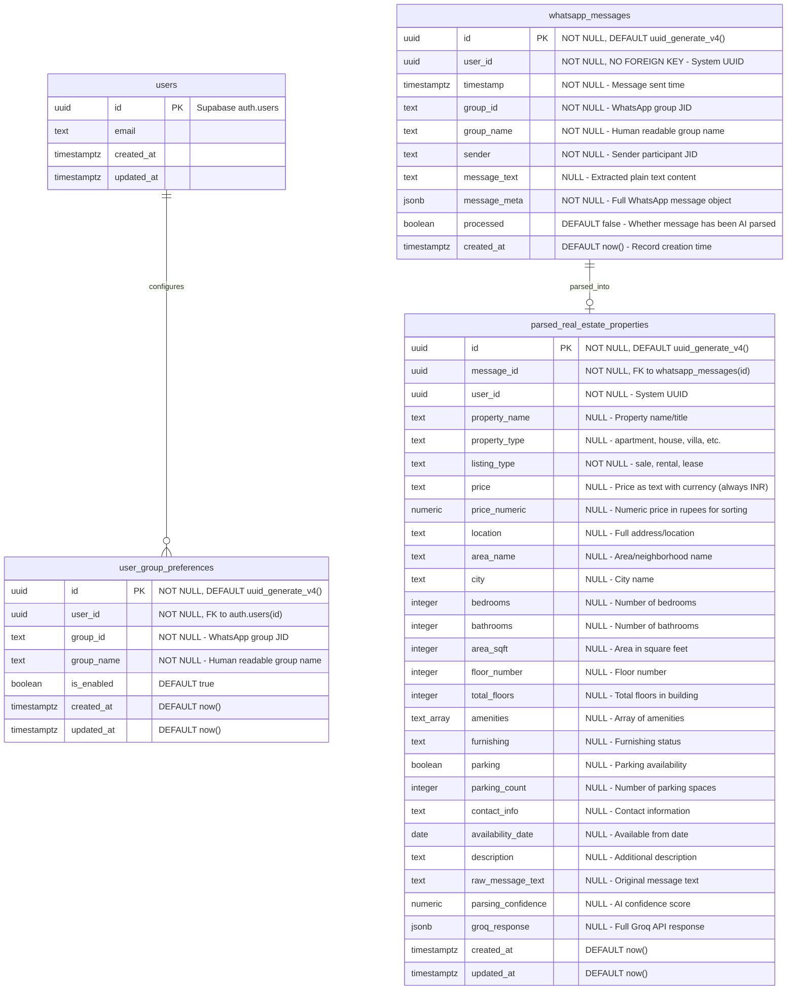

# Entity Relationship Diagram (ERD)

## WhatsApp Real Estate Bot Database Schema

## Database Schema Overview

This document describes the database schema for the WhatsApp Real Estate Bot application.

## Tables

### whatsapp_messages

This table stores all WhatsApp messages from monitored groups.

| Column         | Type                       | Constraints                                       | Description                                             |
| -------------- | -------------------------- | ------------------------------------------------- | ------------------------------------------------------- |
| `id`           | `uuid`                     | PRIMARY KEY, NOT NULL, DEFAULT uuid_generate_v4() | Unique identifier for each message                      |
| `user_id`      | `uuid`                     | NOT NULL, NO FOREIGN KEY                          | System UUID for centralized storage                     |
| `timestamp`    | `timestamp with time zone` | NOT NULL                                          | When the message was sent in WhatsApp                   |
| `group_id`     | `text`                     | NOT NULL                                          | WhatsApp group JID (e.g., `120363401437046636@g.us`)    |
| `group_name`   | `text`                     | NOT NULL                                          | Human-readable group name (e.g., "Real Estate Connect") |
| `sender`       | `text`                     | NOT NULL                                          | WhatsApp participant JID who sent the message           |
| `message_text` | `text`                     | NULL                                              | Extracted plain text content from the message           |
| `message_meta` | `jsonb`                    | NOT NULL                                          | Full WhatsApp message object in JSON format             |
| `processed`    | `boolean`                  | DEFAULT false                                     | Whether the message has been processed by AI parser     |
| `created_at`   | `timestamp with time zone` | DEFAULT now()                                     | When the record was inserted into the database          |

### user_group_preferences

This table stores user preferences for group monitoring (optional - for future filtering).

| Column       | Type                       | Constraints                             | Description                                  |
| ------------ | -------------------------- | --------------------------------------- | -------------------------------------------- |
| `id`         | `uuid`                     | PRIMARY KEY, DEFAULT uuid_generate_v4() | Unique identifier for each preference        |
| `user_id`    | `uuid`                     | NOT NULL, REFERENCES auth.users(id)     | User ID from Supabase auth                   |
| `group_id`   | `text`                     | NOT NULL                                | WhatsApp group JID (e.g., `120363@g.us`)     |
| `group_name` | `text`                     | NOT NULL                                | Human-readable name of the WhatsApp group    |
| `is_enabled` | `boolean`                  | DEFAULT true                            | Whether monitoring is enabled for this group |
| `created_at` | `timestamp with time zone` | DEFAULT now()                           | When the preference was created              |
| `updated_at` | `timestamp with time zone` | DEFAULT now()                           | When the preference was last updated         |

Unique constraint: `(user_id, group_id)`

### parsed_real_estate_properties

This table stores structured real estate data parsed from WhatsApp messages using AI.

| Column               | Type                       | Constraints                                       | Description                                        |
| -------------------- | -------------------------- | ------------------------------------------------- | -------------------------------------------------- |
| `id`                 | `uuid`                     | PRIMARY KEY, NOT NULL, DEFAULT uuid_generate_v4() | Unique identifier for each parsed property         |
| `message_id`         | `uuid`                     | NOT NULL, REFERENCES whatsapp_messages(id)        | Reference to the original WhatsApp message         |
| `user_id`            | `uuid`                     | NOT NULL                                          | System UUID matching the original message          |
| `property_name`      | `text`                     | NULL                                              | Name/title of the property                         |
| `property_type`      | `text`                     | NULL                                              | Type: apartment, house, villa, commercial, etc.    |
| `listing_type`       | `text`                     | NOT NULL                                          | Type: sale, rental, lease                          |
| `price`              | `text`                     | NULL                                              | Price as text with currency (always in INR)        |
| `price_numeric`      | `numeric`                  | NULL                                              | Numeric price in rupees for sorting/filtering      |
| `location`           | `text`                     | NULL                                              | Full address/location                              |
| `area_name`          | `text`                     | NULL                                              | Area/neighborhood name                             |
| `city`               | `text`                     | NULL                                              | City name                                          |
| `bedrooms`           | `integer`                  | NULL                                              | Number of bedrooms                                 |
| `bathrooms`          | `integer`                  | NULL                                              | Number of bathrooms                                |
| `area_sqft`          | `integer`                  | NULL                                              | Area in square feet                                |
| `floor_number`       | `integer`                  | NULL                                              | Floor number                                       |
| `total_floors`       | `integer`                  | NULL                                              | Total floors in building                           |
| `amenities`          | `text[]`                   | NULL                                              | Array of amenities                                 |
| `furnishing`         | `text`                     | NULL                                              | Furnishing status: furnished, semi-furnished, etc. |
| `parking`            | `boolean`                  | NULL                                              | Whether parking is available                       |
| `parking_count`      | `integer`                  | NULL                                              | Number of parking spaces                           |
| `contact_info`       | `text`                     | NULL                                              | Contact information from message                   |
| `availability_date`  | `date`                     | NULL                                              | Available from date                                |
| `description`        | `text`                     | NULL                                              | Additional description/details                     |
| `raw_message_text`   | `text`                     | NULL                                              | Original message text for reference                |
| `parsing_confidence` | `numeric(3,2)`             | NULL                                              | AI parsing confidence score (0.00 to 1.00)         |
| `groq_response`      | `jsonb`                    | NULL                                              | Full Groq API response for debugging               |
| `created_at`         | `timestamp with time zone` | DEFAULT now()                                     | When the record was created                        |
| `updated_at`         | `timestamp with time zone` | DEFAULT now()                                     | When the record was last updated                   |

## ERD Diagram



## Indexes

Consider adding these indexes for better performance:

```sql
-- Index for querying messages by user
CREATE INDEX idx_whatsapp_messages_user_id ON whatsapp_messages(user_id);

-- Index for querying messages by group
CREATE INDEX idx_whatsapp_messages_group_id ON whatsapp_messages(group_id);
CREATE INDEX idx_whatsapp_messages_group_name ON whatsapp_messages(group_name);

-- Index for time-based queries
CREATE INDEX idx_whatsapp_messages_timestamp ON whatsapp_messages(timestamp);

-- Composite index for common queries
CREATE INDEX idx_whatsapp_messages_user_group_timestamp ON whatsapp_messages(user_id, group_name, timestamp DESC);

-- Index for user group preferences
CREATE INDEX idx_user_group_preferences_user_id ON user_group_preferences(user_id);

-- Full-text search index for message content
CREATE INDEX idx_whatsapp_messages_text_search ON whatsapp_messages USING gin(to_tsvector('english', message_text));

-- Index for processing status
CREATE INDEX idx_whatsapp_messages_processed ON whatsapp_messages(processed);
CREATE INDEX idx_whatsapp_messages_unprocessed_timestamp ON whatsapp_messages(processed, timestamp) WHERE processed = false;

-- Indexes for parsed properties
CREATE INDEX idx_parsed_properties_message_id ON parsed_real_estate_properties(message_id);
CREATE INDEX idx_parsed_properties_user_id ON parsed_real_estate_properties(user_id);
CREATE INDEX idx_parsed_properties_listing_type ON parsed_real_estate_properties(listing_type);
CREATE INDEX idx_parsed_properties_property_type ON parsed_real_estate_properties(property_type);
CREATE INDEX idx_parsed_properties_location ON parsed_real_estate_properties(location);
CREATE INDEX idx_parsed_properties_price_numeric ON parsed_real_estate_properties(price_numeric);
CREATE INDEX idx_parsed_properties_bedrooms ON parsed_real_estate_properties(bedrooms);
CREATE INDEX idx_parsed_properties_parking_count ON parsed_real_estate_properties(parking_count);
CREATE INDEX idx_parsed_properties_created_at ON parsed_real_estate_properties(created_at);

-- Full-text search index for property search
CREATE INDEX idx_parsed_properties_text_search ON parsed_real_estate_properties
USING gin(to_tsvector('english', coalesce(property_name, '') || ' ' || coalesce(description, '') || ' ' || coalesce(location, '')));
```

## Notes

- **whatsapp_messages** uses a system UUID (`00000000-0000-0000-0000-000000000000`) for centralized storage
- **user_group_preferences** allows users to configure which groups to monitor
- **message_text** column provides fast text search capabilities without parsing JSONB
- **message_meta** column preserves full WhatsApp message structure for complex operations
- The system supports centralized message storage

## Performance Features

- **Full-text search**: `message_text` column with GIN index enables fast text search
- **Fast queries**: Plain text searches avoid expensive JSONB operations
- **API efficiency**: Most endpoints can return just `message_text` instead of full metadata
- **Indexing**: Optimized indexes for common query patterns
