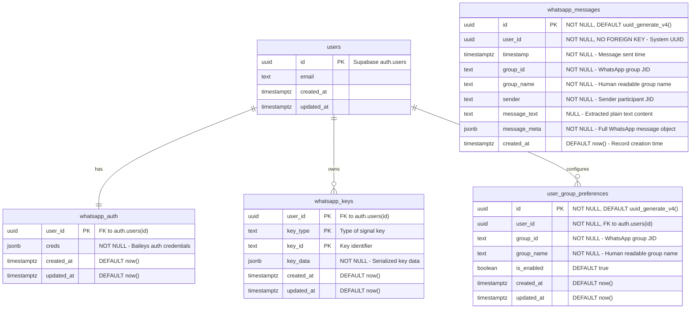

# Entity Relationship Diagram (ERD)

## WhatsAp| `updated_at` | `timestamp with time zone` | DEFAULT now() | When the key was last updated |

Primary key: `(user_id, key_type, key_id)` Real Estate Bot Database Schema

## Database Schema Overview

This document describes the database schema for the WhatsApp Real Estate Bot application.

## Tables

### whatsapp_messages

This table stores all WhatsApp messages from monitored groups.

| Column         | Type                       | Constraints                                       | Description                                             |
| -------------- | -------------------------- | ------------------------------------------------- | ------------------------------------------------------- |
| `id`           | `uuid`                     | PRIMARY KEY, NOT NULL, DEFAULT uuid_generate_v4() | Unique identifier for each message                      |
| `user_id`      | `uuid`                     | NOT NULL, NO FOREIGN KEY                          | System UUID for centralized storage                     |
| `timestamp`    | `timestamp with time zone` | NOT NULL                                          | When the message was sent in WhatsApp                   |
| `group_id`     | `text`                     | NOT NULL                                          | WhatsApp group JID (e.g., `120363401437046636@g.us`)    |
| `group_name`   | `text`                     | NOT NULL                                          | Human-readable group name (e.g., "Real Estate Connect") |
| `sender`       | `text`                     | NOT NULL                                          | WhatsApp participant JID who sent the message           |
| `message_text` | `text`                     | NULL                                              | Extracted plain text content from the message           |
| `message_meta` | `jsonb`                    | NOT NULL                                          | Full WhatsApp message object in JSON format             |
| `created_at`   | `timestamp with time zone` | DEFAULT now()                                     | When the record was inserted into the database          |

### whatsapp_auth

This table stores WhatsApp authentication credentials per user.

| Column       | Type                       | Constraints                            | Description                                   |
| ------------ | -------------------------- | -------------------------------------- | --------------------------------------------- |
| `user_id`    | `uuid`                     | PRIMARY KEY, REFERENCES auth.users(id) | User ID from Supabase auth                    |
| `creds`      | `jsonb`                    | NOT NULL                               | WhatsApp authentication credentials (Baileys) |
| `created_at` | `timestamp with time zone` | DEFAULT now()                          | When the credentials were first created       |
| `updated_at` | `timestamp with time zone` | DEFAULT now()                          | When the credentials were last updated        |

### whatsapp_keys

This table stores WhatsApp signal protocol keys per user.

| Column       | Type                       | Constraints                         | Description                             |
| ------------ | -------------------------- | ----------------------------------- | --------------------------------------- |
| `user_id`    | `uuid`                     | NOT NULL, REFERENCES auth.users(id) | User ID from Supabase auth              |
| `key_type`   | `text`                     | NOT NULL                            | Type of key (pre-keys, session, sender) |
| `key_id`     | `text`                     | NOT NULL                            | Unique identifier for this key          |
| `key_data`   | `jsonb`                    | NOT NULL                            | Serialized key data                     |
| `created_at` | `timestamp with time zone` | DEFAULT now()                       | When the key was created                |
| `updated_at` | `timestamp with time zone` | DEFAULT now()                       | When the key was last updated           |

### user_group_preferences

This table stores user preferences for group monitoring (optional - for future filtering).

| Column       | Type                       | Constraints                             | Description                                  |
| ------------ | -------------------------- | --------------------------------------- | -------------------------------------------- |
| `id`         | `uuid`                     | PRIMARY KEY, DEFAULT uuid_generate_v4() | Unique identifier for each preference        |
| `user_id`    | `uuid`                     | NOT NULL, REFERENCES auth.users(id)     | User ID from Supabase auth                   |
| `group_id`   | `text`                     | NOT NULL                                | WhatsApp group JID (e.g., `120363@g.us`)     |
| `group_name` | `text`                     | NOT NULL                                | Human-readable name of the WhatsApp group    |
| `is_enabled` | `boolean`                  | DEFAULT true                            | Whether monitoring is enabled for this group |
| `created_at` | `timestamp with time zone` | DEFAULT now()                           | When the preference was created              |
| `updated_at` | `timestamp with time zone` | DEFAULT now()                           | When the preference was last updated         |

Unique constraint: `(user_id, group_id)`

## ERD Diagram



## Indexes

Consider adding these indexes for better performance:

```sql
-- Index for querying messages by user
CREATE INDEX idx_whatsapp_messages_user_id ON whatsapp_messages(user_id);

-- Index for querying messages by group
CREATE INDEX idx_whatsapp_messages_group_id ON whatsapp_messages(group_id);
CREATE INDEX idx_whatsapp_messages_group_name ON whatsapp_messages(group_name);

-- Index for time-based queries
CREATE INDEX idx_whatsapp_messages_timestamp ON whatsapp_messages(timestamp);

-- Composite index for common queries
CREATE INDEX idx_whatsapp_messages_user_group_timestamp ON whatsapp_messages(user_id, group_name, timestamp DESC);

-- Indexes for WhatsApp keys lookup
CREATE INDEX idx_whatsapp_keys_user_type ON whatsapp_keys(user_id, key_type);

-- Index for user group preferences
CREATE INDEX idx_user_group_preferences_user_id ON user_group_preferences(user_id);

-- Full-text search index for message content
CREATE INDEX idx_whatsapp_messages_text_search ON whatsapp_messages USING gin(to_tsvector('english', message_text));
```

## Notes

- **whatsapp_messages** uses a system UUID (`00000000-0000-0000-0000-000000000000`) for centralized storage
- **whatsapp_auth** and **whatsapp_keys** are per-user for individual WhatsApp connections
- **user_group_preferences** allows users to configure which groups to monitor
- **message_text** column provides fast text search capabilities without parsing JSONB
- **message_meta** column preserves full WhatsApp message structure for complex operations
- The system supports both centralized message storage and per-user authentication

## Performance Features

- **Full-text search**: `message_text` column with GIN index enables fast text search
- **Fast queries**: Plain text searches avoid expensive JSONB operations
- **API efficiency**: Most endpoints can return just `message_text` instead of full metadata
- **Indexing**: Optimized indexes for common query patterns
